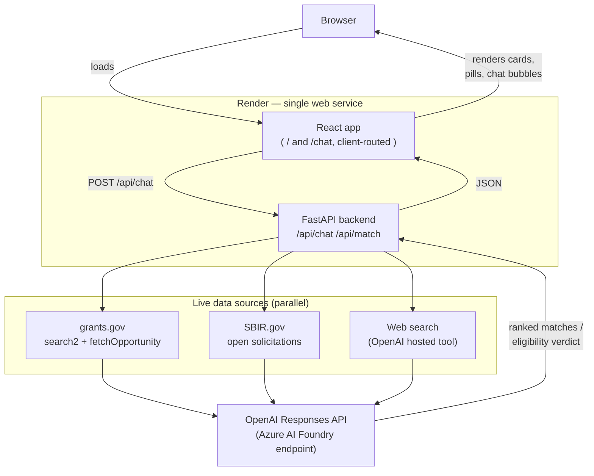

# Granted — Project Documentation

**AI grants advisor.** Tell it about your project in plain conversation; it matches you
against live funding opportunities, checks your actual eligibility against each grant's
real requirements, and explains exactly how to apply.

Built for **FireHacks 2026** (AI & Research tracks), August 9, 2026 — Zoho HQ, Pleasanton.

---

## 1. The problem

Early-stage founders, students, and small nonprofits don't usually lose out on grants
because their idea is bad — they lose out because the process is a maze: eligibility
buried in dense PDFs, deadlines scattered across pages, no way to know what you actually
qualify for until you've sunk hours into an application. Granted turns "I have an idea but
no clue how to get it funded" into a matched, demystified funding path — a conversation,
not a form.

---

## 2. Software used

| Layer | Technology | Version | Purpose |
|---|---|---|---|
| Backend | Python | 3.14 | Runtime |
| | FastAPI | 0.141.1 | API framework |
| | Uvicorn | 0.52.1 | ASGI server |
| | httpx | 0.28.1 | Async HTTP client (grants.gov, SBIR.gov) |
| | Pydantic | 2.13.4 | Request/response schemas |
| | python-dotenv | 1.2.2 | Local env var loading |
| | openai (SDK) | 2.53.0 | AI backend client |
| Frontend | React | 19.2.8 | UI |
| | Vite | 8 | Dev server / build |
| | react-router-dom | 7.18.2 | Client-side routing (`/`, `/chat`) |
| AI | OpenAI **Responses API** | — | via Azure AI Foundry endpoint (not api.openai.com) |
| | Model | `gpt-4.1-mini` | Configurable via `OPENAI_MODEL` |
| | Hosted `web_search` tool | — | Live web search, no custom scraper |
| Data sources | grants.gov REST API | `v1` | `search2` + `fetchOpportunity` — live federal opportunities |
| | SBIR.gov public API | — | Open SBIR/STTR solicitations (degrades gracefully; flaky) |
| Infra | Render | — | Single web service, `render.yaml` |
| | GitHub | — | Version control (`bhargava-gumpula/Spendr`, repurposed) |

**Why these choices:**
- **grants.gov + SBIR.gov** for the MVP: both are free, live, and require no signup —
  critical for a same-day build.
- **OpenAI Responses API** (not Chat Completions): forced structured tool-calls for every
  AI decision (never free-text parsing), plus the hosted `web_search` tool needed for live
  grant discovery beyond the two government APIs.
- **Render**: explicit hackathon infra requirement; single service serves both the built
  React app and the API to keep deployment simple.

---

## 3. Architecture



### Request flow

1. **User sends a chat message.** The frontend holds all conversation state client-side
   (stateless backend, no auth, no DB) and posts the full message history each turn.
2. **Router decision** (`ai_chat.route`): one forced-tool-call to the model decides the
   turn's intent — `ask_question`, `search`, `explain_grant`, or `chat`.
3. **`search`**: `matching.run_match()` queries grants.gov, SBIR.gov, and the web search
   tool **in parallel** (`asyncio.gather`), fetches full eligibility text for each
   candidate, then one AI call (`ai_match.rank_and_explain`) scores and explains every
   candidate against the user's actual profile — grounded only in the real fetched text.
4. **`explain_grant`**: starts (or continues) a per-grant eligibility interview
   (`ai_chat.advise_on_grant`) that asks targeted follow-up questions about specific
   unverified criteria before giving a final qualifies verdict + application steps.
5. Results stream back as structured JSON and render as chat bubbles, match cards
   (animated score, qualifies/deadline pills), and verdict cards.

### Two AI jobs, one call pattern

Every AI decision in this app uses **forced structured tool-calls** — the model must call
a specific function and return typed JSON, never free text left to be parsed. This is the
backbone of the "never fabricate, never guess" requirement: the schema itself has fields
like `qualifies: enum[yes, likely, unclear, no]` and `confidence: enum[high, low]`, so
there's no ambiguous prose to misinterpret.

- **Match & explain**: given a project profile + N candidate grants' real eligibility
  text, return per-grant `match_score`, `qualifies`, `fit_reasons`, `gap_reasons`,
  `confidence`.
- **Eligibility interview**: given one grant's real text + the conversation so far,
  either `ask_question` (one targeted, specific question) or `give_verdict`
  (`qualifies` + `eligibility_summary` + `steps`).
- **Document checklist** (Phase 2, opt-in): given a grant's title/opportunity number/known
  attachment filename, the model uses live web search to find and read the grant's actual
  full NOFO/RFP PDF, then reports `required_documents` and `application_steps` as a clean,
  separate list — grants.gov's own API only exposes attachment *metadata* (filename), not
  a documented download endpoint, so this reads the real PDF via search rather than a
  direct fetch. `found: false` if the real document can't be located — never a guessed list.

---

## 4. Data integrity rules (enforced in code, not just prompted)

The spec's core requirement — *if a grant's requirements are inaccessible, say so, never
guess* — is enforced with a code-level guardrail, not left to the model's discretion:

```python
if detail.fetch_status != "ok":
    qualifies = "unclear"
    confidence = "low"
```

This overrides the model's own self-reported confidence. It was added after live testing
caught the model giving a **confident "no" verdict off just a grant's title**, despite
being told its eligibility text was unavailable — a real violation caught by testing, not
a hypothetical.

Other integrity choices:
- **NSF Award Search** was scaffolded in Phase 0 (`services/nsf.py`, live in
  `/api/smoke-test`) but deliberately **not** wired into matching — it's historical,
  already-funded data, not an open application target. Live web search superseded the
  planned "NSF as supporting evidence" approach from the original plan.
- **SBIR.gov** originally pointed at the **awards** endpoint (historical) before a bug
  was caught and fixed to point at **solicitations** (open) — awards aren't something you
  can apply to.
- Web search results are bounded (`max_tool_calls`) and labeled "found via web search" in
  the UI — distinct from official government sources.

---

## 5. Implementation process

Built in order, phase-gated (no phase started without explicit go-ahead):

1. **Scaffold** — FastAPI + React skeleton, grants.gov/SBIR.gov/NSF clients, confirmed
   live connectivity, Render config, migrated into the `Spendr` GitHub repo (after
   confirming — and getting explicit permission to overwrite — its prior unrelated
   content).
2. **Grant matching v1** — structured intake form, AI ranking with real eligibility
   checks, deadline countdown display.
3. **UI polish pass** — modern redesign (animated score rings, expandable match reasons,
   skeleton loading states).
4. **Conversational rework** — replaced the form with a chat interface per feedback that
   users shouldn't have to volunteer structured data; added a real eligibility interview
   instead of one-shot answers.
5. **Two-page split** — landing page + `/chat`, with client-side routing.
6. **Provider swap** — Anthropic → OpenAI, then discovered mid-swap that the actual key
   was an **Azure AI Foundry** key requiring the Responses API and a custom `base_url`
   (diagnosed by systematically testing the key against multiple providers and endpoint
   shapes until the real one was found).
7. **Reliability fixes from live testing** — made grant-interview continuation
   deterministic (client tracks the active grant explicitly, bypassing the router on
   continuation turns) after finding the smaller model unreliably inferred it from
   conversation history alone; added the confidence/qualifies data-integrity guardrail.
8. **Visual identity** — committed to a single dark navy/blue theme; later redesigned the
   landing page with Figma-inspired layout (referenced figma.com directly): floating
   layered mockup cards, bold left-weighted typography, pill buttons, a custom 4-dot logo
   mark.
9. **Live web search** — pulled forward from the original Phase 3 stretch scope, added as
   a third parallel data source using OpenAI's hosted `web_search` tool.
10. **Phase 2: document checklist** — investigated grants.gov's attachment API (both the
    legacy and new official `simpler.grants.gov` OpenAPI spec) and found no documented,
    unauthenticated PDF download endpoint; pivoted to reading the real PDF via the
    web-search tool instead, surfaced as an opt-in "Get full document checklist" action.

Every phase/major change was tested end-to-end with **real AI calls** (not mocked)
before being considered done — including deliberately re-testing after each reliability
fix to confirm the actual failure mode was resolved.

---

## 6. Current status

| Phase | Status |
|---|---|
| 0 — Scaffold | ✅ Done |
| 1 — Grant matching (+ web search pulled forward from Phase 3) | ✅ Done, tested live |
| 2 — Requirement extraction (document checklist from real PDFs) | ✅ Done, tested live |
| 4 — Deploy to Render | Not started |

**Known trade-offs:**
- Web search adds real latency (~20–30s per search turn vs. ~5–10s without it); reading a
  full PDF for the document checklist can take up to ~30s, which is why it's an opt-in
  button rather than automatic.
- SBIR.gov's public API has been observed rate-limited during the build — the app
  degrades gracefully (returns no SBIR results rather than erroring) when this happens.

---

## 7. Running it locally

See [`README.md`](README.md) for setup commands. Quick version:

```bash
# backend
cd backend && python3 -m venv venv && ./venv/bin/pip install -r requirements.txt
cp .env.example .env   # fill in OPENAI_API_KEY (+ OPENAI_BASE_URL if not api.openai.com)
./venv/bin/uvicorn app.main:app --reload --port 8000

# frontend
cd frontend && npm install && npm run dev
```
